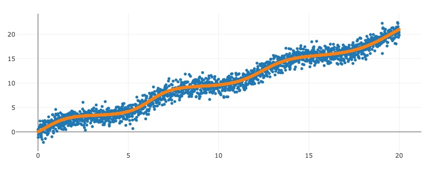

<h1  align="center">Inside Deep Learning with Burn</h1>

<a href="https://github.com/aledelunap/inside-deep-learning-with-burn/issues/new?labels=question&title=New+question">Ask a question 🙋🏽</a>
·
<a href="https://github.com/aledelunap/inside-deep-learning-with-burn/issues/new?labels=bug&title=New+bug+report">Report a bug 🐛</a>

<h2  align="center">👋 About </h2>

This repository contains the code for the book [Inside Deep Learning](https://www.amazon.com/Inside-Deep-Learning-Algorithms-Models/dp/1617298638) using the [Rust](https://www.rust-lang.org) programming language and the [Burn](https://burn.dev) crate.

  

> :warning: This repository is being used to learn both Rust and Burn. The implementation might not be adequate nor optimal.

<h2 align="center">📖 Contents</h2>

Currently, this repository includes the code for the following chapters:

- Chapter 2 Fully connected networks
  - 2.1 Neural networks as optimization
  - 2.2 Building our first neural network
  - 2.3 Classification problems

- Chapter 3 Convolutional neural networks
  - 3.4 Putting it into practice: Our first CNN
  - 3.5 Adding pooling to mitigate object movement

